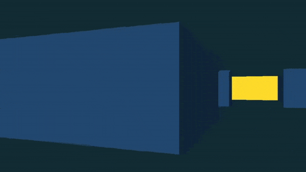

MAZE PROJECT 🎮
===============
_**Feels like the 90's**_


Introduction
------------

This project is my take on game programming, using the **C** programming language and the **SDL** library. It makes use of a method known as `raycasting` to be able to draw 2D objects as 3D projections of themselves, such as lines as vertical walls. Hope you enjoy!

See the project page [here](https://leroy-m.github.io/maze-project/)!

**🇻ersion🗃️**: 1.0.0

**🇱icense💳**: Free BSD

**🇨ontributor/ 🇦uthor🖋**: Leroy Mwasela

Installation
------------

This game is a **linux-based** terminal-executed program. This means that once downloaded locally, it is run without installing. The details on how to run it can be founded in the [usage](#usage) section below.

Usage
-----

As afore mentioned, the game is meant to run only on **linux-based** operating system distributions. Once the binary is downloaded, it should be made into an executable. To do so, open the terminal in the directory which the binary has been downloaded to, and type the following command:

```bash
chmod u+x game
```

After making the binary `game` an executable, follow up the previous command with the one following here below to run the program:

```bash
./game
```

Contributing
------------

This project has been a sole project, being contributed to by one author as captured in the [introduction](#introduction) section. A lot of helpful resources online have been made use of to bring it to completion.

Description
-----------

Three C source files and a header file later, the end result as at this point was a single-level, plain-looking game environment. As can be seen below.



This could be improved upon by adding texturing to the walls to better the aesthetics. Then working on a few more levels and developing the character a bit more to give the impression of a realistic artifact.
